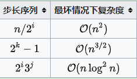

#### 希尔排序的算法思想及代码  

希尔排序，也称递减增量排序算法，是插入排序的一种更高效的改进版本。希尔排序是**非稳定排序算法**。

希尔排序是基于插入排序的以下两点性质而提出改进方法的：

* 插入排序在对几乎已经排好序的数据操作时，效率高，即可以达到线性排序的效率
* 但插入排序一般来说是低效的，因为插入排序每次只能将数据移动一位  

原始的算法实现在最坏的情况下需要进行$\mathrm{O}\left(n^{2}\right)$的比较和交换。 V. Pratt的书[1]对算法进行了少量修改，可以使得性能提升至$O\left(n \log ^{2} n\right)$。这比最好的比较算法的$O(n \log n)$要差一些。  

希尔排序通过将比较的全部元素分为几个区域来提升插入排序的性能。这样可以让一个元素可以一次性地朝最终位置前进一大步。然后算法再取越来越小的步长进行排序，算法的最后一步就是普通的插入排序，但是到了这步，需排序的数据几乎是已排好的了（此时插入排序较快）。  

假设有一个很小的数据在一个已按升序排好序的数组的末端。如果用复杂度为O(n2)的排序（冒泡排序或插入排序），可能会进行n次的比较和交换才能将该数据移至正确位置。而希尔排序会用较大的步长移动数据，所以小数据只需进行少数比较和交换即可到正确位置。  

一个更好理解的希尔排序实现：将数组列在一个表中并对列排序（用插入排序）。重复这过程，不过每次用更长的列来进行。最后整个表就只有一列了。将数组转换至表是为了更好地理解这算法，算法本身仅仅对原数组进行排序（通过增加索引的步长，例如是用i += step_size而不是i++ ）。  

例如，假设有这样一组数`[ 13 14 94 33 82 25 59 94 65 23 45 27 73 25 39 10 ]`，如果我们以步长为5开始进行排序，我们可以通过将这列表放在有5列的表中来更好地描述算法，这样他们就应该看起来是这样：  
```
13 14 94 33 82
25 59 94 65 23
45 27 73 25 39
10
```
然后我们对每列进行排序：  
```
10 14 73 25 23
13 27 94 33 39
25 59 94 65 82
45
```  
将上述四行数字，依序接在一起时我们得到：`[ 10 14 73 25 23 13 27 94 33 39 25 59 94 65 82 45 ]`.这时10已经移至正确位置了，然后再以3为步长进行排序：  
```
10 14 73
25 23 13
27 94 33
39 25 59
94 65 82
45
```
排序之后变为：  
```
10 14 13
25 23 33
27 25 59
39 65 73
45 94 82
94
```
最后以1步长进行排序（此时就是简单的插入排序了）。  
##### 步长选择  

步长的选择是希尔排序的重要部分。只要最终步长为1任何步长序列都可以工作。算法最开始以一定的步长进行排序。然后会继续以一定步长进行排序，最终算法以步长为1进行排序。当步长为1时，算法变为普通插入排序，这就保证了数据一定会被排序。  

  

已知的最好步长序列是由Sedgewick提出的`(1, 5, 19, 41, 109,...)`，该序列的项来自 $9 \times 4^{i}-9 \times 2^{i}+1$ 和 $2^{i+2} \times\left(2^{i+2}-3\right)+1$这两个算式。这项研究也表明“比较在希尔排序中是最主要的操作，而不是交换。”用这样步长序列的希尔排序比插入排序要快，甚至在小数组中比快速排序和堆排序还快，但是在涉及大量数据时希尔排序还是比快速排序慢。  

另一个在大数组中表现优异的步长序列是（斐波那契数列除去0和1将剩余的数以黄金分割比的两倍的幂进行运算得到的数列）：`(1, 9, 34, 182, 836, 4025, 19001, 90358, 428481, 2034035, 9651787, 45806244, 217378076, 1031612713,…)`  

代码:  
```
void shell_sort(int arr[], int len) {
	int gap, i, j;
	int temp;
	for (gap = len >> 1; gap > 0; gap >>= 1)
		for (i = gap; i < len; i++) {
			temp = arr[i];
			for (j = i - gap; j >= 0 && arr[j] > temp; j -= gap)
				arr[j + gap] = arr[j];
			arr[j + gap] = temp;
		}
}
```


**参考**  
[1] https://zh.wikipedia.org/zh-cn/%E5%B8%8C%E5%B0%94%E6%8E%92%E5%BA%8F  
[2] [十大经典排序算法（动图演示）](https://www.cnblogs.com/onepixel/p/7674659.html)  
